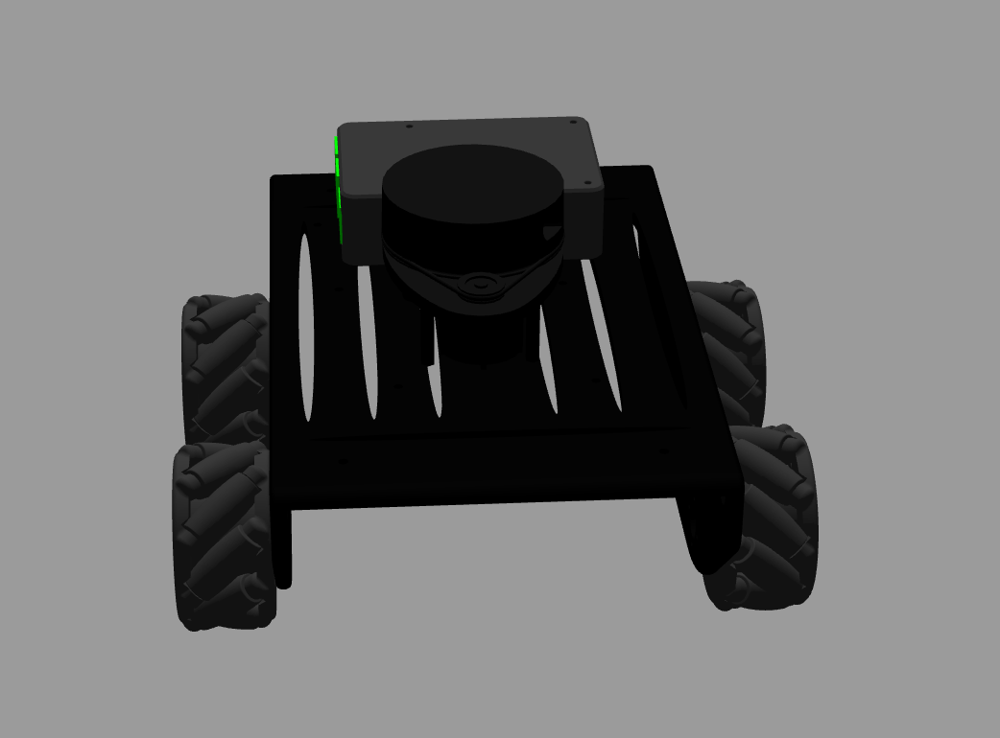
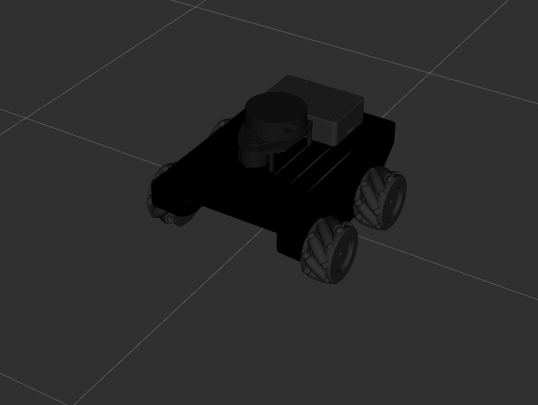
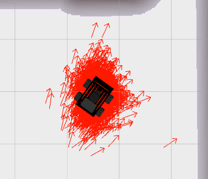
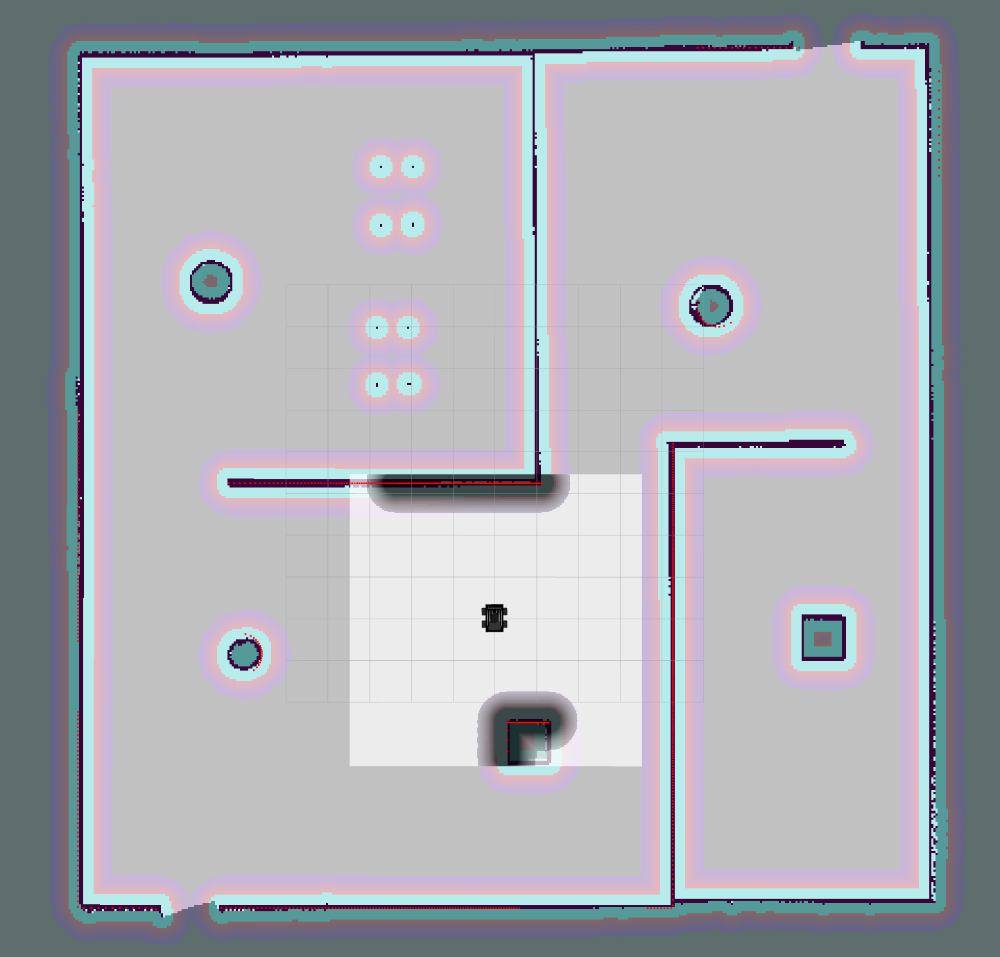
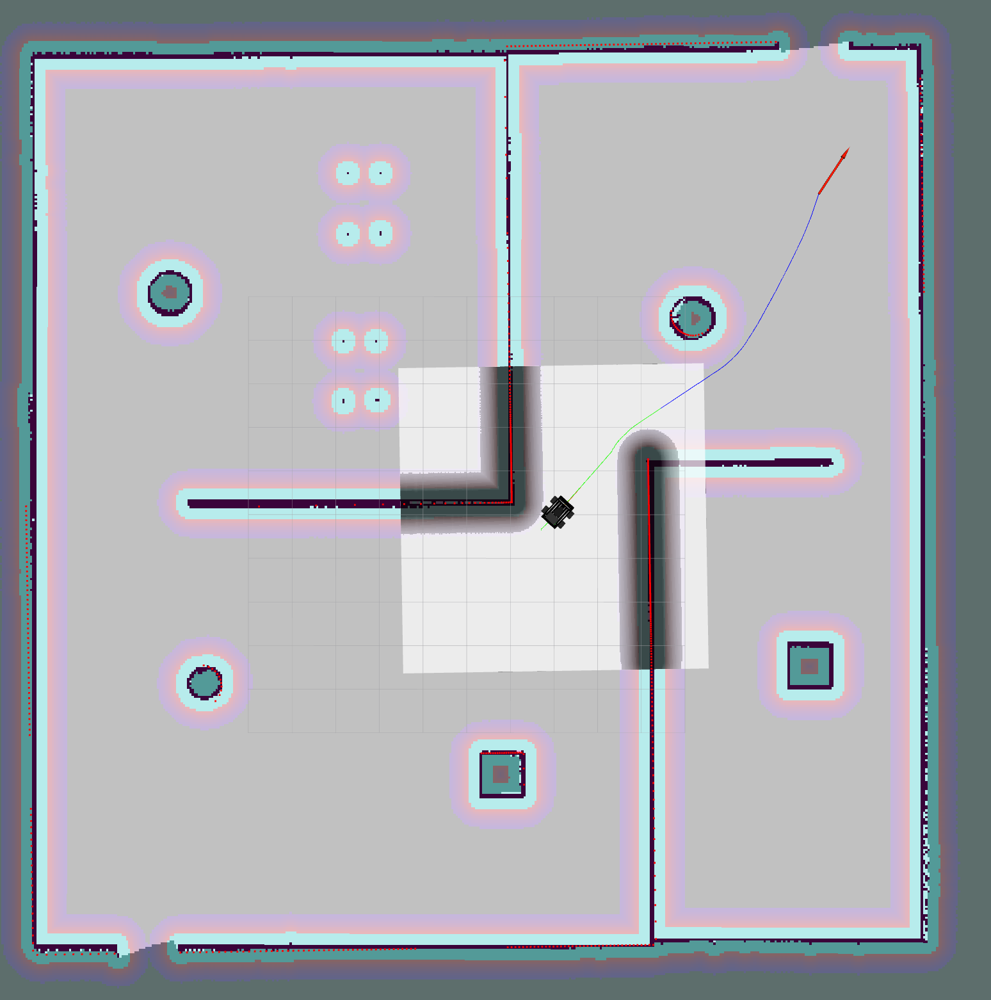
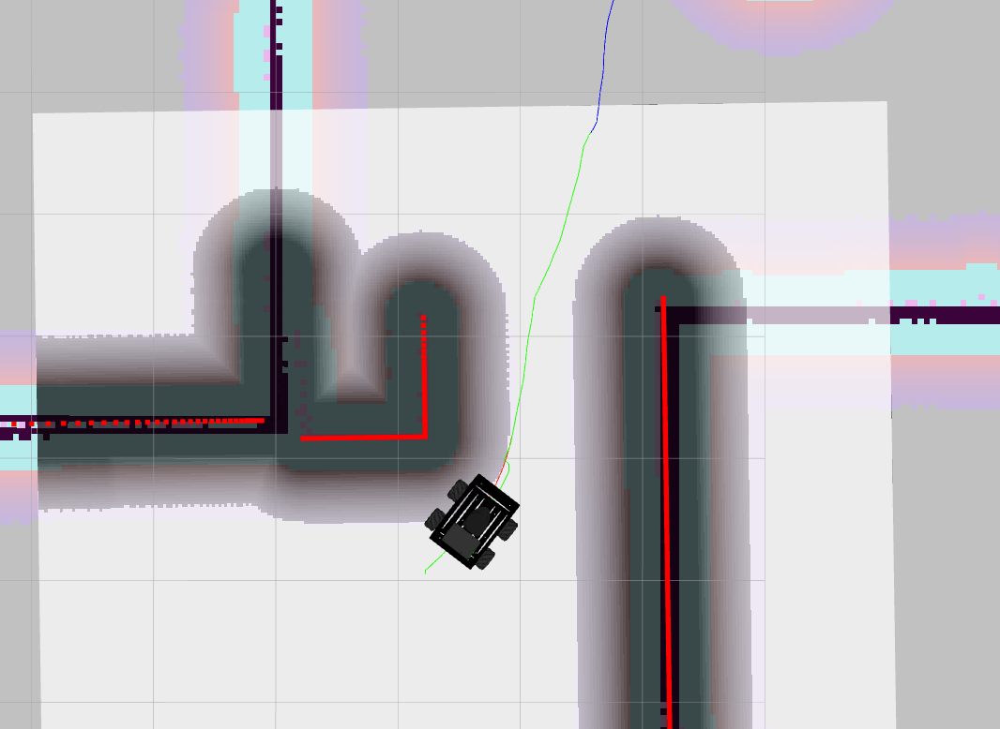

# Nova Robot Project
### Directory Structure
    .nova_ws/ 
        └── src/
             ├── nova_nav/
             │    ├── config/param
             │    │     ├── base_local_planner_params.yaml
             │    │     ├── costmap_common_params.yaml
             │    │     ├── dwa_local_planner_params.yaml
             │    │     ├── global_costmap_params.yaml
             │    │     ├── global_planner_params.yaml
             │    │     ├── local_costmap_params.yaml
             │    │     └── move_base_params.yaml
             │    ├── launch/
             │    │     ├── amcl.launch
             │    │     ├── gmapping.launch
             │    │     ├── move_base.launch
             │    │     └── navigation.launch
             │    ├── maps/
             │    │     ├── final_map.pgm
             │    │     └── final_map.yaml
             │    ├── CMakeLists.txt
             │    └── package.xml
             ├── nova_slam/
             │       ├── launch/
             │       │     ├── amcl.launch
             │       │     └── gmapping.launch
             │       ├── CMakeLists.txt
             │       └── package.xml
             ├── nova_gazebo/
             │       ├── launch/
             │       │     ├── gazebo.launch
             │       │     └── rviz.launch
             │       ├── world/
             │       │     └── arche.world
             │       ├── CMakeLists.txt
             │       └── package.xml
             ├── nova_description/
             │       ├── launch/
             │       │     └── rviz.launch
             │       ├── meshes/
             │       │     ├── MecanumLeft.stl
             │       │     ├── MecanumRight.stl
             │       │     ├── Raspberry_pi_4_case.stl
             │       │     ├── Raspberry_pi_4.stl
             │       │     ├── Robot_base.stl             
             │       │     └── rplidar.dae
             │       ├── rviz_config/
             │       │     ├── main.rviz
             │       │     ├── nav.rviz
             │       ├── urdf/
             │       │     ├── color_gazebo
             │       │     ├── color.xacro
             │       │     ├── nova_gazebo.xacro
             │       │     ├── nova.gazebo             
             │       │     └── nova.urdf.xacro
             │       ├── CMakeLists.txt
             │       └── package.xml  
             ├── CMakeLists.txt
             └── README.md      


The goal of this project is to program a robot that can take the map generated earlier, localize itself in that map, and navigate the robot to pick up and drop off virtual object. Here is a list of steps undertaken to accomplish that goal:

 - Build a simulated world in Gazebo building editor.
 - Build a map of the environment using gmapping.
 - Use Adaptive Monte Carlo Localisation (AMCL) to detect the robot position within the known map.
 - Use the ROS move_base library to plot a path to a target pose and navigate to it.


## About the project
The mobile robot begins by driving around and scanning the area using a lidar to generate a static map of the environment. With this map in hand, it utilizes odometry and laser data to determine its position through adaptive Monte Carlo Localization (AMCL). When given a navigation goal, the robot plans its path using Dijkstra's algorithm and then navigates to the specified goal using DWA as a local planner.

## Description
The project consists of the following parts:
1. A Gazebo world and a mobile robot.
2. ROS packages: [map_server](http://wiki.ros.org/map_server), 
[amcl](http://wiki.ros.org/amcl), [move_base](http://wiki.ros.org/move_base),
[slam-gmapping](http://wiki.ros.org/slam_gmapping) 
and [teleop_twist_keyboard](http://wiki.ros.org/teleop_twist_keyboard).

## Prerequisites
1. ROS (noetic), Gazebo on Linux
2. CMake & g++/gcc, C++11
3. Install some dependencies

```
$ sudo apt-get update && sudo apt-get upgrade -y
$ sudo apt-get install ros-noetic-map-server
$ sudo apt-get install ros-noetic-amcl
$ sudo apt-get install ros-noetic-move-base
$ sudo apt-get install ros-noetic-slam-gmapping
```

## Build and Launch

1. Clone the project into your workspace
```bash
cd "your workspace"
git clone https://github.com/Ahmed-Magdi1/Nova_Robot.git
cd Nova_Robot
```

2. Build the project
```bash
catkin_make
source devel/setup.bash
```

3. Simulate Robot in Gazebo

```bash
roslaunch nova_gazebo gazebo.launch
```

4. SLAM gmapping to perform SLAM and generate a map:
```bash
roslaunch nova_nav gmapping.launch
```

5. Navigation
```bash
roslaunch nova_nav navigation.launch
```

Set a `2D Nav Goal` in RViz to command the robot to a target position.

# Robot In Action

<table style="width:100%">
  <tr>
    <th><p>
           </a>
           <br>Robot In Gazebo
        </p>
    </th>
    <th><p>
           </a>
           <br>Robot In Rviz
      </p>
    </th>
  </tr>
  <tr>
    <th><p>
           </a>
           <br>AMCL Particles
      </p>
    </th>
    <th><p>
           </a>
           <br>Global_and_Local costmap
      </p>
    </th>
  </tr>
</table>

# Planners

<table style="width:100%">
  <tr>
    <th><p>
           </a>
           <br>Global_Planner
        </p>
    </th>
    <th><p>
           </a>
           <br>Local_Planner
      </p>
    </th>
  </tr>
</table>

# Robot tf

